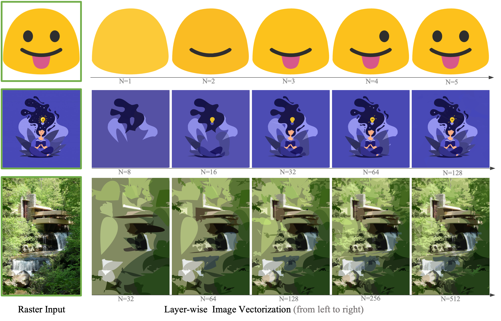

# LIVE- Towards Layer-wise Image Vectorization (CVPR 2022 Oral)

[Xu Ma](https://ma-xu.github.io/), 
[Yuqian Zhou](https://yzhouas.github.io/), 
[Xingqian Xu](https://www.linkedin.com/in/xingqian-xu-97b46526/), 
[Bin Sun](https://www.linkedin.com/in/bin-sun-2993b4142/), 
[Valerii Filev](https://www.linkedin.com/in/valeriy-filev-4704a9123/), 
[Nikita Orlov](https://www.linkedin.com/in/nukich74/), 
[Yun Fu](http://www1.ece.neu.edu/~yunfu/), 
[Humphrey Shi](https://www.humphreyshi.com/home)

[[arXiv]()], 
[[Colab Demo]()], 
[[HuggingFace Space]()], 
Primary contact: [[Xu Ma](mailto:ma.xu1@northeastern.edu)]

<br><br>
<div align="center">
    
</div>
We present a new method to progressively generate a SVG that fits the raster image in a layer-wise fashion. Given an arbitrary input image, LIVE recursively learns the visual concepts by adding new optimizable closed bezier paths and optimizing all these paths.
<br><br><br><br>

<div align="center">
    
    
    
    
</div>
From left to right are (1)<b>input raster image</b>,  (2)output SVGs of <b>DiffVG (path=5)</b>, (3)output SVGs of <b>DiffVG (path=256)</b>, and (4)output of our <b>LIVE (path=5)</b>.
With only 5 paths, DiffVG cannot reconstruct the input image. When increasing the path number to 256 (which is significantly larger than the number of necessary paths), DiffVG is able to reconstruct the input. 
Differently, our LIVE is able to reconstruct the input smiling face by only 5 paths, and shows a compact layer-wise representation (<small>We re-scale the speed to match the three gifs.</small>).

## Installation
We suggest users to use the conda for creating new python environment. 

**Requirement**: 5.0<GCC<6.0;  nvcc >10.0.

```bash
git clone git@github.com:ma-xu/LIVE.git
conda create -n live python=3.7
conda install -y pytorch torchvision -c pytorch
conda install -y numpy scikit-image
conda install -y -c anaconda cmake
conda install -y -c conda-forge ffmpeg
pip install svgwrite svgpathtools cssutils numba torch-tools scikit-fmm easydict visdom
pip install opencv-python==4.5.4.60  # please install this version to avoid segmentation fault.

cd DiffVG
git submodule update --init --recursive
python setup.py install
cd ..
```


## Run Experiments 
```bash
conda activate live
cd LIVE
# Please modify the paramters accordingly.
python main.py --config <config.yaml> --experiment <experiment-setting> --signature <given-folder-name> --target <input-image> --log_dir <log-dir>
# Here is an simple example:
python main.py --config config/base.yaml --experiment experiment_5x1 --signature smile --target figures/smile.png --log_dir log/
```

## Reference

    @inproceedings{xu2022live,
        title={Towards Layer-wise Image Vectorization},
        author={Ma, Xu and Zhou, Yuqian and Xu, Xingqian and Sun, Bin and Filev, Valerii and  Orlov, Nikita and Fu, Yun and Shi, Humphrey},
        booktitle={Proceedings of the IEEE conference on computer vision and pattern recognition},
        year={2022}
    }

## Acknowledgement
Our implementation is mainly based on the [diffvg](https://github.com/BachiLi/diffvg) codebase. We gratefully thank the authors for their wonderful works.


## LICENSE
LIVE is under the Apache-2.0 license. Please contact the authors for commercial use.


